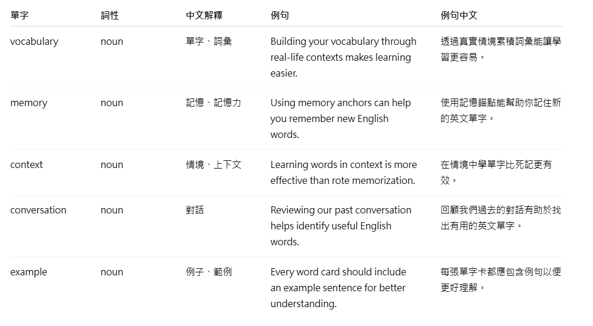
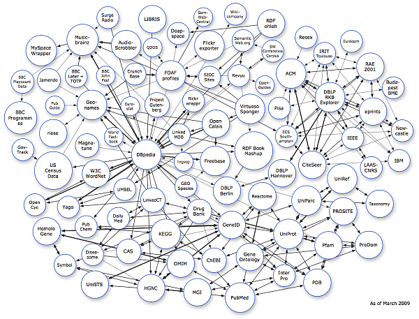
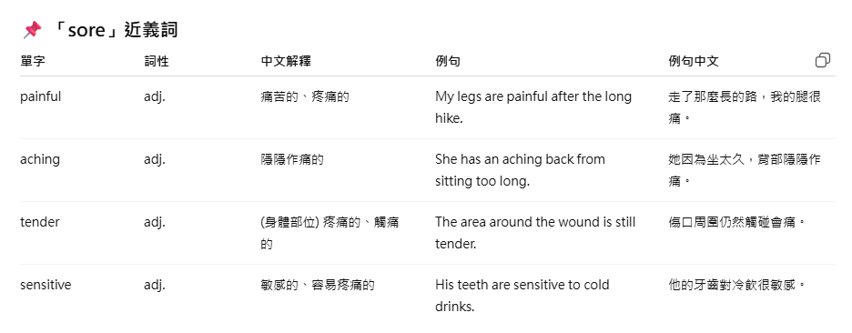
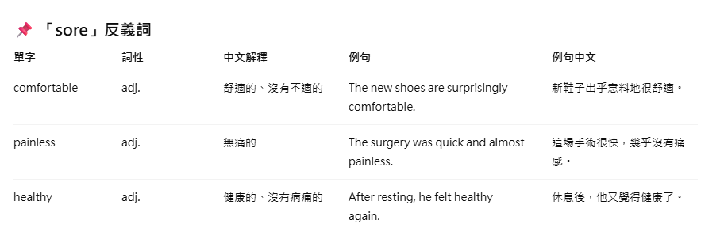
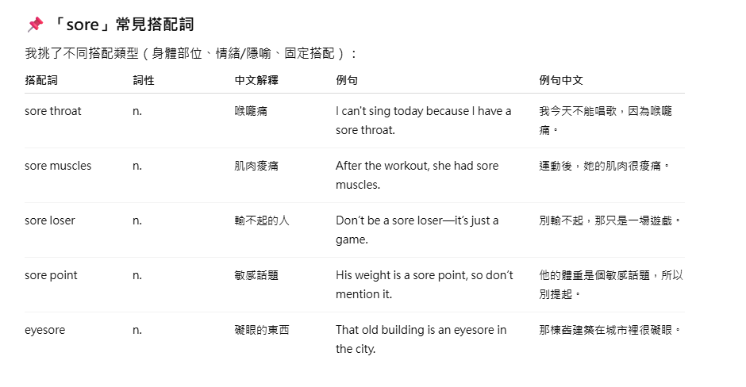

# Day 2｜從零開始，用情境學習與語意網路打造你的英文學習資料庫

你有沒有這樣的經驗？今天背了十個單字，覺得自己很認真，結果隔天只記得兩三個；有些甚至完全沒印象，彷彿昨天的努力被人一夜清空。最可怕的是，就算你真的「背下來」了，放到真實對話裡卻還是用不出來。

為什麼？因為我們常常把英文當成一個個孤立的符號在背。就像是：**"apple = 蘋果"**。可是當你真的要在餐廳點餐時，大腦卻沒辦法馬上把這個單字「喚出來」。因為你學到的，只是一個沒有場景、沒有故事、沒有連結的字。

---

## 情境學習（Situated Learning）：讓單字活過來

語言從來不是一個個孤立的字，而是活生生的場景。

想像一下：
- 如果你第一次學到 *"run"*，只是翻著單字卡，背「run = 跑」。
- 和你在現實生活中，因為快遲到而拼命趕公車，腦中閃過 “I have to run to catch the bus!”。

哪一個會更容易記得？當然是後者。因為那不只是單字，而是連同情境、畫面、甚至你的心跳加速一起記進去。
所以情境學習強調：**學習應該把單字放進故事裡、放進場景裡，甚至跟你的生活連結起來**。這樣單字才有「第一次的生命力」，不會只是孤零零的符號。
並且認知到什麼情境時該使用什麼單字，從而真正學會單字的使用方法。

### 怎麼從情境引出單字

**方法一（主題導向）** 設定一個你感興趣或想學習的場景，讓 AI 幫你生成與該主題相關的單字與例句。

**方法二（對話回顧）** 如果你先前跟 AI(ChatGPT) 有對話，從對話中提取出與你自己經驗有關的單字。

---

**方法一：主題導向 Prompt**
```
請幫我生成 5 個與「___」相關的英文單字卡。
欄位包含：單字, 詞性, 中文解釋, 例句, 例句中文
```

> 於「___」輸入一個你感興趣的情境主題。  
> 
> **範例：** 第一次去健身房的經歷


*▲ 主題導向 AI 對話示範*

**方法二：對話回顧 Prompt**
```
請閱讀我和你之間的對話內容，找出相關的5個重要英文單字。
欄位包含：單字, 詞性, 中文解釋, 例句, 例句中文
```



*▲ 對話回顧 AI 對話示範*

---

## 語意網路（Semantic Networks）：讓單字長出枝葉

但是，光有第一次的印象還不夠。但如果只停留在這裡，它還是很快會被忘掉，因此我們還要再搭配使用語意網路。
*語意網路*這個概念最早源於1969年心理學家Collin和Quillian所提出，他們發現人類大腦儲存語言的方式不像書架那樣整齊排列，而是像一張巨大的蜘蛛網，每個單字都與其他概念相互連接。



*▲ 語意網路示意圖*

例如：
- 跟「run」意思相近的：*jog, sprint*
- 相反的：*walk, rest*
- 常一起出現的：*run a business, run late, run fast*
- 延伸的情境：*marathon, track, race*

當你腦中有了這些連結，就不會只記得「run=跑」，而是能靈活地在不同情境裡用出來。
因此這就是為什麼只靠死記單字跟翻譯常常會記不久，因為單字彼此是孤立的，但如果你連他的近義詞、反義詞、常見搭配詞...串在一起，就彷彿站在一個相互連接的網子上，對於初學者可以更事半功倍的學習，因此我們要繼續沿用剛剛在*情境學習*所習得的5個關於健身房的單字繼續做延伸。

```
請幫我生成"__"的近義詞、反義詞及常見的搭配詞(不同搭配類型都各挑幾個)，
並且以上單字欄位包含：單字, 詞性, 中文解釋, 例句, 例句中文
```

> 於「___」輸入一個你已熟悉的單字。  
> 
> **範例：** 剛健身房例子中所習得的單字，sore 痠痛的。





*▲ 語意網路 AI 對話示範*

---
## 結語
透過「情境學習」與「語意網路」的搭配，我們能夠：
1. **賦予單字生命力：**不再是孤立的符號，而是連同場景、故事、甚至你的親身經驗一起記住。
2. **建立關聯網路：**讓單字不只是單獨存在，而是與近義、反義、常見搭配詞交織，形成可延展的語言地圖。
3. **從 0 到 1，再到 N：**先透過情境建立第一次深刻印象，再透過語意網路不斷擴散，讓單字靈活可用。

當你學會把單字放進真實情境，並在腦中串連出語意網路，你已經成功建立起一個專屬於自己的英文學習資料庫。  
但單字即使有了網路，如果沒有長期的感官與記憶錨定，還是可能逐漸模糊。
> 在 Day 3 中，我們將介紹「記憶錨點」，讓你的單字真正「黏」在腦海裡，透過雙重編碼把它們轉化為立體化的感官記憶。
