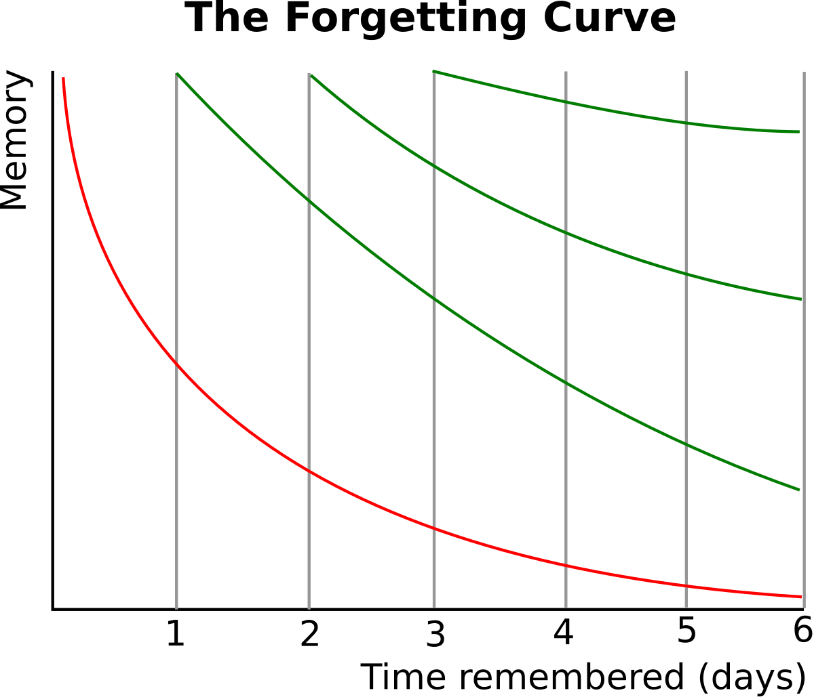

# Day 5｜用間隔複習，讓英文知識成為長期記憶

在 Day 4 學習了主動回憶法後，我們已經知道如何透過測驗來檢驗學習效果，確保真正掌握單字而不是只有「看起來熟悉」的假象。但光是知道「如何有效學習」還不夠，更關鍵的問題是：「什麼時候複習最有效？」

今天我們要深入探討**記憶曲線**的科學原理，並學習如何運用間隔複習讓你的英文知識從短期記憶轉化為長期記憶。

**記憶曲線**由德國心理學家 Hermann Ebbinghaus 在 1885 年提出，描述人類學習後記憶的自然衰退規律。它揭示了一個關鍵事實：記憶在最初幾天衰退最快，之後逐漸趨緩。



*▲ Hermann Ebbinghaus記憶曲線圖*

**如圖所示**，紅色的曲線代表的就是記憶自然衰退的過程，它顯示了記憶量會隨著時間快速下降。而綠色的曲線則代表「間隔複習」的效果，它說明了每一次的複習都能將記憶曲線重置，並且隨著複習次數的增加，曲線會變得越來越平緩，代表記憶也變得越來越穩固。

這張圖清晰地說明了，**當主動回憶遇上記憶曲線，就形成了科學化的學習系統**：在記憶即將衰退的關鍵時間點，透過主動回憶來重新強化記憶。

---

## 記憶曲線的實作方法(Anki)

理論很美好，但如何實際執行間隔複習呢？手動計算複習時間太複雜，這時候我們需要一個自動化的工具——**Anki**。

### 什麼是 Anki？

Anki 是一個基於間隔重複算法的記憶卡軟體，它會根據你每次回答的表現自動調整下次復習的時間間隔。當你答對時，間隔會拉長；答錯時，間隔會縮短，讓你在「即將忘記」的時候進行復習。

### Anki 的核心優勢

1. **自動計算最佳複習時間**：不需要手動記錄，系統會根據記憶曲線自動安排
2. **個人化學習節奏**：每個人的記憶能力不同，Anki 會根據你的表現調整
3. **跨平台同步**：手機、電腦、網頁版都能使用，隨時隨地複習
4. **豐富的卡片格式**：支援文字、圖片、音頻，完美配合記憶錨點理論

### Anki 實作步驟

#### 步驟一：下載與安裝 Anki

1. 到官網 [ankiweb.net](https://ankiweb.net) 下載軟體
2. 註冊 AnkiWeb 帳號（用於同步）
3. 在手機上下載 AnkiMobile（iOS）或 AnkiDroid（Android）

#### 步驟二：AI 自動化製作學習卡組

我們直接用前面學習的健身房單字來示範自動化流程：

**原始單字表**：
| 單字 | 詞性 | 中文解釋 | 例句 | 例句中文 |
|------|------|----------|------|----------|
| gym | noun | 健身房 | I felt a bit shy when I walked into the gym for the first time. | 第一次走進健身房時，我覺得有點羞澀。 |
| treadmill | noun | 跑步機 | I warmed up on the treadmill before trying other exercises. | 在嘗試其他運動之前，我先在跑步機上熱身。 |
| dumbbell | noun | 啞鈴 | The trainer showed me how to hold a dumbbell properly. | 教練教我如何正確握啞鈴。 |
| stretch | verb | 伸展 | I stretched my arms and legs to prepare for the workout. | 我伸展手臂來為運動做準備。 |
| sore | adjective | 痠痛的 | The next morning, my muscles were sore from lifting weights. | 隔天早上，我的肌肉因舉重而痠痛。 |

#### 步驟三：讓 AI 轉換成 Anki CSV 格式

#### 👉 實際可用的 Prompt 範本：

```
請將以下單字表轉換成 Anki CSV 格式：

[貼上上面的單字表]

CSV 格式要求：
欄位：正面,背面
- 正面：英文單字
- 背面：完整資訊（音標+詞性+中文+例句+語意網路相關單字）

請直接輸出可複製的CSV格式。
```

**AI 輸出範例**：
```csv
正面,背面
gym,"**Gym** /dʒɪm/ (noun) 健身房<br><br>💪 例句：I felt a bit shy when I walked into the gym for the first time.<br>中文：第一次走進健身房時，我覺得有點羞澀。<br><br>🔗 相關：fitness center, workout, exercise, trainer"
treadmill,"**Treadmill** /ˈtrɛdˌmɪl/ (noun) 跑步機<br><br>🏃 例句：I warmed up on the treadmill before trying other exercises.<br>中文：在嘗試其他運動之前，我先在跑步機上熱身。<br><br>🔗 相關：running, cardio, warm-up, belt"
dumbbell,"**Dumbbell** /ˈdʌmˌbɛl/ (noun) 啞鈴<br><br>💪 例句：The trainer showed me how to hold a dumbbell properly.<br>中文：教練教我如何正確握啞鈴。<br><br>🔗 相關：barbell, weights, lifting, curl"
```

#### 步驟四：一鍵匯入 Anki

1. 複製 AI 生成的 CSV 內容
2. 貼到記事本並存成「健身房英文.csv」
3. 打開 Anki，點選「檔案 → 匯入」
4. 選擇 CSV 檔案，確認欄位對應正確
5. 點選「匯入」完成！

#### 步驟五：Anki 如何實現自動化記憶曲線

當你開始使用 Anki 後，系統會根據你的回答表現自動調整複習時間：

**自動化機制**：
- **答對「簡單」**：間隔拉長更多（例：3天 → 1週）
- **答對「普通」**：按標準間隔（例：1天 → 3天）  
- **答錯**：間隔重置，很快再出現（例：重回10分鐘）

**實際運作範例**（以 dumbbell 為例）：
```
第1天：初學 → 答對 → 隔1天複習
第3天：複習 → 答對 → 隔4天複習  
第7天：複習 → 答錯 → 隔1天複習
第8天：複習 → 答對 → 隔3天複習
第11天：複習 → 答對 → 隔10天複習
⋮
```

**核心價值**：你完全不需要記住什麼時候該複習什麼單字，Anki 會在你「即將忘記但還沒完全忘記」的最佳時機提醒你。這就是科學化間隔複習的威力——讓遺忘為你服務，而不是成為阻礙。

透過 Anki 的間隔複習系統，你不需要手動計算複習時間，也不用擔心會忘記重要的單字。系統會在最佳時機提醒你複習，讓學習變得更有效率、更持久。從今天開始，讓科學為你的英文學習護航吧！

#### Anki進階功能

**添加圖片**：在任何卡片中點選「編輯」，可插入圖片或截圖來強化記憶錨點。

**製作填空練習**：可以手動編輯卡片，將例句製作成填空格式：
- 原例句：I warmed up on the treadmill before trying other exercises.
- 填空版：I warmed up on the {{c1::treadmill}} before trying other exercises.

**語音練習**：Anki 支援錄音功能，可以錄下正確發音或自己的練習音檔。

---

## 用科學理論學語言：從零散知識到系統學習

回顧這五天的學習，我們掌握了一個完整的科學化英文學習系統：**情境學習**讓我們從生活場景中發現單字，**語意網路**幫助擴展相關詞彙，**記憶錨點**透過圖像和故事深化印象，**主動回憶**檢驗真正的掌握程度，最後**間隔複習**將短期記憶轉化為長期記憶。這五個理論環環相扣，形成從「發現→擴展→深化→檢驗→維持」的完整學習流程，讓我們不再盲目死背，而是遵循大腦的工作原理來高效學習英文

> 
> 學會單字只是起點，接下來我們將運用這套科學系統結合AI工具，帶你從零散詞彙組建成流暢的句子、段落，甚至完整的對話和文章。你將學會如何讓AI成為你的表達教練，不只幫你練習語法，更能訓練你用英文思維來組織想法。
