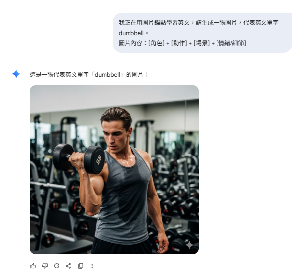
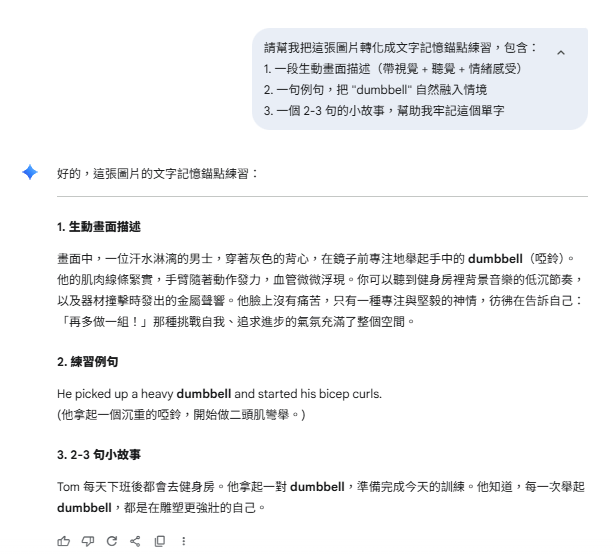

# Day 3｜記憶錨點的運用

在 Day 2 學習了**情境學習**與**語意網路**後，相信你已經能從生活情境中獲得相關單字，並透過語意網路擴散更多相關詞彙，得到屬於自己的單字學習資料庫。今天我們要來討論如何讓這些單字真正「黏」在腦海裡——**記憶錨點**。

**記憶錨點**來自於**心理學家 Allen Paivio 在 1971 年提出的雙重編碼理論（Dual-Coding Theory）**。這個理論認為，當我們學習一個單字時，如果能同時運用語言和圖像兩種系統來處理資訊，例如將單字與畫面、情緒、聲音等感官記憶綁定，記憶效果會比單純背誦文字強得多。

因此，今天我們將學習如何運用**記憶錨點**來強化從情境學習中獲得的單字記憶。

---

## 記憶錨點練習

當我們透過「情境學習」已經得到一組單字後，下一步就是要讓它們真的「黏」在腦海裡。當一個單字同時以「圖像」和「語言」兩種形式儲存在大腦中時，記憶會更牢固，也更容易被喚起。

在 AI 的幫助下，我們可以很輕鬆地完成這個步驟。建議的流程是：

### 步驟一：圖片錨點（直觀記憶）

先讓 AI 生成與單字對應的圖片，這樣能建立第一層「直覺」的錨點。

#### 👉 實際可用的 Prompt 範本：

```
我正在用圖片錨點學習英文，請生成一張圖片，代表英文單字 "___"。
圖片內容：[角色] + [動作] + [場景] + [情緒/細節]
```

> 於第一部分產出的五個單字中挑選一個，放入"___"。  
> 
> **範例：** dumbbell



*▲ 圖片錨點 AI 對話示範*

這些圖片能夠直接把單字和一個具體的畫面綁在一起，避免「死背文字」的抽象感。

### 步驟二：文字錨點（深化語境）

接著，我們再利用圖片作為基礎，請 AI 幫我們生成更豐富的文字描述。這樣單字不僅有「圖像記憶」，還能帶入感官和故事。

#### 👉 實際可用的 Prompt 範本：

繼續在練習圖片錨點的對話框中練習：

```
請幫我把這張圖片轉化成文字記憶錨點練習，包含：  
1. 一段生動畫面描述（帶視覺 + 聽覺 + 情緒感受）  
2. 一句例句，把 "___" 自然融入情境  
3. 一個 2-3 句的小故事，幫助我牢記這個單字
```

> 其中"___"放入與第二部分/步驟一相同的的單字。    
> 
> **範例：** dumbbell



*▲ 文字錨點 AI 對話示範*

透過這樣的做法，圖片提供了「直覺的第一層錨點」，而文字則進一步帶入**場景、情緒、語境**，成為「第二層深度錨點」。

#### 這樣一來，每個單字都會先透過圖片被「看見」，再透過故事被「感受」，最後在腦海中形成牢固的錨點。

---

## 結語

透過記憶錨點的雙重編碼，我們能夠：

1. **建立視覺記憶**：透過圖片錨點，讓單字有具體的畫面連結
2. **深化感官體驗**：透過文字錨點，將單字與情緒、聲音、感受綁定
3. **強化記憶連結**：當圖像和語言同時作用時，記憶效果遠勝於單純文字背誦

當你學會了情境學習、語意網路，再加上記憶錨點技巧，你已經能夠有效地「獲得」和「記住」單字。但學會了並不代表能長期保持，下一步我們需要科學的方法來檢驗和強化這些記憶。

> 在 Day 4 中，我們將介紹主動回憶法，透過科學的測驗方式來確保你真正掌握這些單字，而不是只有「看起來熟悉」的假象！
