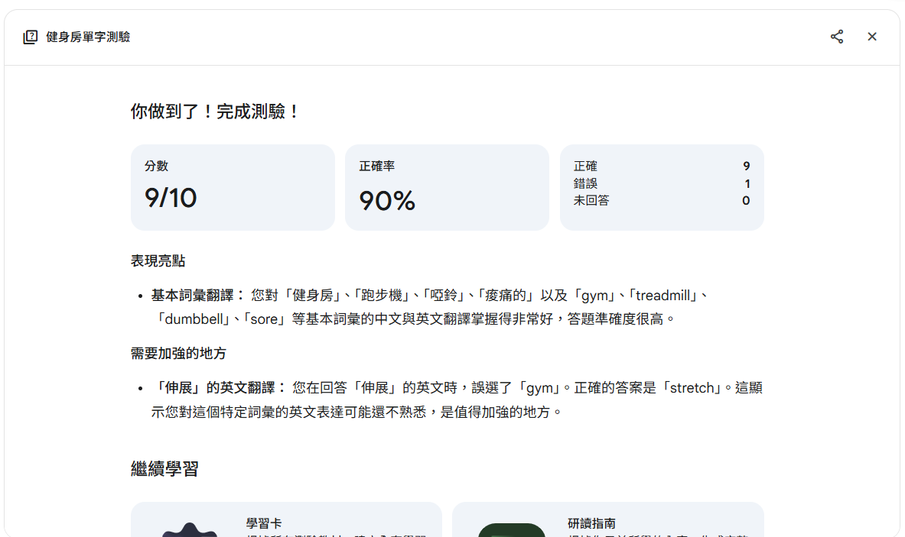
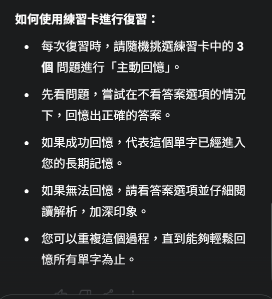

# Day4 | 主動回憶與時間曲線，訓練大腦加深印象
在Day 3學習到了記憶錨點，今天讓我們來了解甚麼是**主動回憶**

主動回憶法（Active Recall），又稱主動提取法或主動測試法，是一種透過主動從記憶中提取資訊來增強記憶和理解能力的學習技巧。 學習者在沒有參考資料的情況下，嘗試回想所學內容，這項努力能加強記憶的神經連接，相比被動學習，能夠更有效地加強記憶和學習效率

而主動回憶法中有一個重要的核心**記憶曲線**
**記憶曲線**- 由德國心理學家 Hermann Ebbinghaus 提出，描述人類在學習後記憶的自然衰退速度。

根據實驗，若不複習，學習後：
- 20分鐘後會忘掉約42%
- 1小時後忘掉56%
- 1天後忘掉74%
- 1週後忘掉77%
- 1個月後忘掉79%
這條曲線顯示：記憶在最初幾天衰退最快，之後逐漸趨緩。

## 第一部分：配對遊戲(以中英單字為例)
**方法一提供AI中英單字**
將我們所學到的單字提供給AI，請AI生成中英配對學習卡

```
1. 我正在學習以下這些單字
牛肉(beef)、豬肉(pork)、雞肉(chicken)、羊肉(lamb)、玉米(corn)、豆子(beans)、生菜(lettuce)、
酪梨(avocado)、香蕉(banana)、蘋果(apple)、橙子(orange)、葡萄(grape)、麵包(bread)、米飯(rice)、
義大利麵(pasta)、水餃(dumpling)、披薩(pizza)、三明治(sandwich)、漢堡(hamburger)、香腸(sausage)、
餅乾(biscuits)、巧克力(chocolate)、薯片(crisps)、珍珠奶茶(Bubble Tea)
2. 請幫我根據記憶曲綫，設計復習計劃
3. 同時每次復習時，出3題主動回憶的練習題
```

> 主動將單字內容提供給AI  

▲ 提供AI單字內容


  

*▲ 答對畫面*

> 答錯題目時，會自動顯示出正確答案，同時保留錯誤答案，可以明確知道錯誤  

*▲ 答錯畫面*

> 完成學習卡後會得到剛剛答題(10題)的狀況  

*▲ 得分狀況*
> 點選”生成更多問題”，可以針對”全部內容”或”錯誤內容” 新增題目(至少新增5題)

*▲ 更多問題*

> 分析我的學習成效，對於答對的題目得到鼓勵，對於答錯的題目得到可能錯誤的原因，更加強學習方向
> 可以針對”全部內容”或”錯誤內容”再重新填寫一份學習卡

*▲ 學習成效分析*

**方法二請AI生成單字**
```
1. 請提供"出國"相關單字，只需要20個
2. 請幫我根據記憶曲綫，設計複習計劃
3. 同時每次復習時，出3題主動回憶的練習題
4. 製作成問答式式練習卡
```

*▲ AI生成單字*

> 如何使用練習卡進行複習


## 第二部分：填空遊戲(以文章為例)

*▲ 提供文章 *


*▲ AI生成文章*

## 第三部分：時間曲線回憶設定
```
請AI記錄學習成效，制定複習計畫
```


##結語
主動回憶法結合時間曲線的好處：
1.	強化神經連結：透過主動提取資訊，大腦會加強相關神經元的連結，讓記憶更穩固
2.	延緩遺忘速度：每次主動回憶都能「重設」遺忘曲線，使記憶衰退變得更慢
3.	最佳複習時機：根據遺忘曲線安排回憶時間點（如第1天、第3天、第7天），可最大化記憶保留
4.	建立長期記憶：多次主動回憶後，資訊會從短期記憶轉移至長期記憶，成為可隨時調用的知識
> 在過去幾天我們學到了語意網路、情境學習與記憶錨點，再加上今天的主動回憶結合時間曲線，接著介紹如何將這些方法套用在Anki上，透過科學化的學習方式建立鞏固的知識體系，增強大腦學習!

