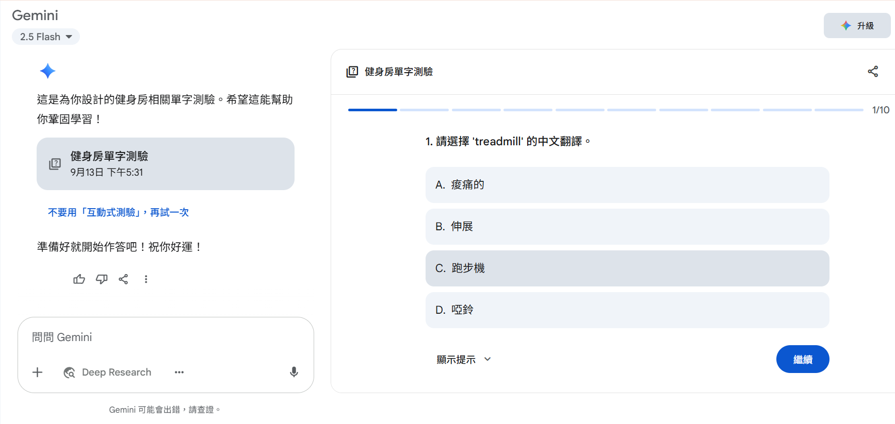

# Day 4｜主動回憶訓練大腦加深印象

在 Day 2、3 學習了情境學習、語意網路、記憶錨點後，今天要介紹兩個能讓記憶更持久的科學方法：**主動回憶法**。

當我們透過情境學習獲得了單字，並利用語意網路擴散單字網，且建立了記憶錨點後，下一步就是要確保這些知識能真正「留住」。單純重複閱讀或抄寫，往往只是「熟悉感」的錯覺，而主動回憶法能真正檢驗我們是否真的學會了。

**主動回憶法**，又稱主動提取法，是一種透過主動從記憶中提取資訊來增強記憶的學習技巧。相對於被動重複閱讀，學習者需要在沒有參考資料的情況下，嘗試回想所學內容。這個過程會強化記憶的神經連接，就像肌肉訓練一樣——每次主動「拉取」記憶，都在加強大腦的記憶肌肉。研究顯示，主動回憶比重複閱讀的學習效率高出 50% 以上。

---

## 主動回憶的實作方法

現在讓我們把理論轉化為實際的學習工具。我們將使用 Day 3 中學到的健身房相關單字，透過兩種主動回憶方式來練習。

### 方法一：配對遊戲（中英單字配對）

還記得 Day 3 我們學習的健身房單字嗎？現在用它們搭配 Gemini 學習功能來做配對練習。

#### 👉 實際可用的 Prompt 範本：

```
我正在學習以下健身房相關單字：  
gym(健身房)、treadmill(跑步機)、dumbbell(啞鈴)、stretch(伸展)、sore(痠痛的)  

請幫我設計一個學習卡測驗，包含：  
1. 10題配對選擇題（中英互譯）  
2. 每答完一題顯示正確答案  
3. 答錯時提供詳細解釋  
4. 最後統計答對率和學習建議  

並直接開始測驗，不須告訴我題目內容
```


*▲ 提供AI單字，製作單字卡測驗*


*▲ 單字卡測驗-答對畫面*


*▲ 單字卡測驗-答錯畫面*

> 答錯題目時，會自動顯示出正確答案，同時保留錯誤答案，可以明確知道錯誤
>


> 點選圖片紅框中的「分析我的學習成效」
>


*▲ 完成學習卡後會得到剛剛答題(10題)的狀況*

### 方法二：填空遊戲（情境文章填空）

第二種方法是把單字放回情境中，透過填空來檢驗理解程度。

#### 👉 實際可用的 Prompt 範本：

```
請用我學過的健身房單字（gym, treadmill, dumbbell, stretch, sore），  
創建一篇「第一次去健身房」的短文，並設計成"學習卡測驗"的練習：  

1. 並使用選擇題填空方式測驗
2. 短文長度約 100-150 字
3. 將學過的單字設為空格
4. 提供單字選項但順序打亂  
5. 完成後請檢查答案並給予回饋    
```


*▲ 提供AI單字，製作短文測驗*

> 與配對遊戲一樣答對與答錯皆會給予後續的提示。
>

中文填英文的學習方式，能讓您直接將母語概念與英文單字連結，有效率地強化記憶與實際應用，特別適合剛開始接觸新詞彙的學習者。有別於您平時習慣的「英文填英文」測驗，這種方法能幫助讀者避開複雜的英文文法，專注於單字本身，讓學習過程更直覺，也更貼近實際的語言轉換情境。

---

## 結語

透過主動回憶法的訓練，我們能夠：

1. **真實檢驗學習效果**：不再依賴「看起來熟悉」的假象，而是透過主動提取來確認是否真正掌握
2. **強化大腦記憶肌肉**：每次主動回想都在加深神經連接，讓記憶更加牢固
3. **提升學習效率**：相比被動重讀，主動回憶的學習效果提升超過 50%
4. **建立學習信心**：透過測驗了解自己的學習狀況，針對弱點加強練習

當你掌握了情境學習、語意網路、記憶錨點，再加上主動回憶法，你的英文學習已經有了科學的基礎。但光是知道「如何有效學習」還不夠，更重要的是「什麼時候復習」。

> 在 Day 5 中，我們將深入探討記憶曲線的奧秘，並介紹如何使用 Anki 建立自動化的間隔複習系統，讓你的學習效果達到最大化！
