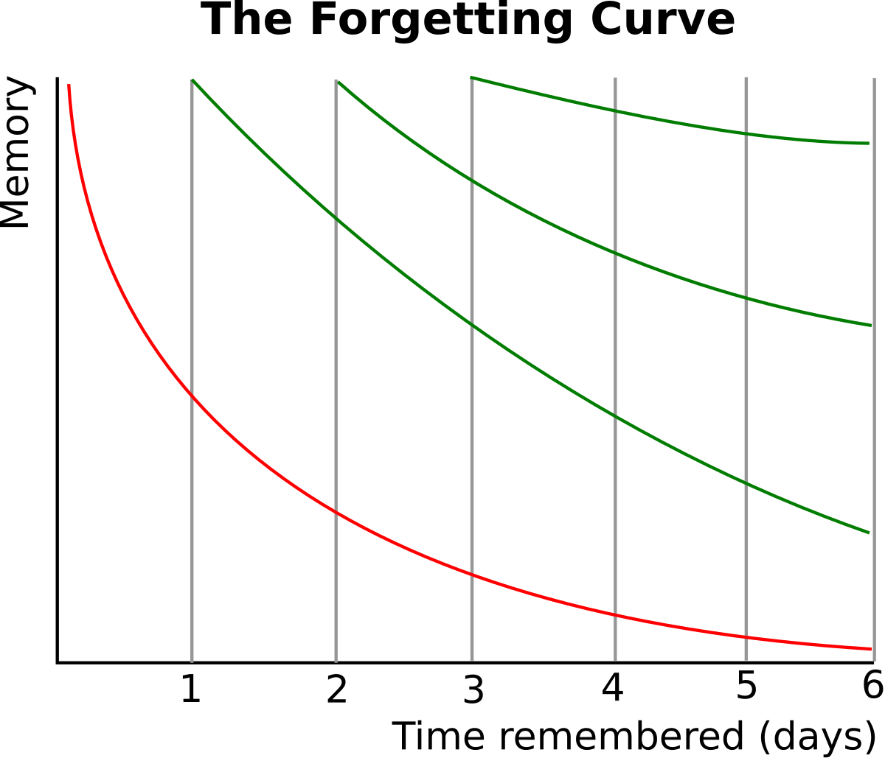
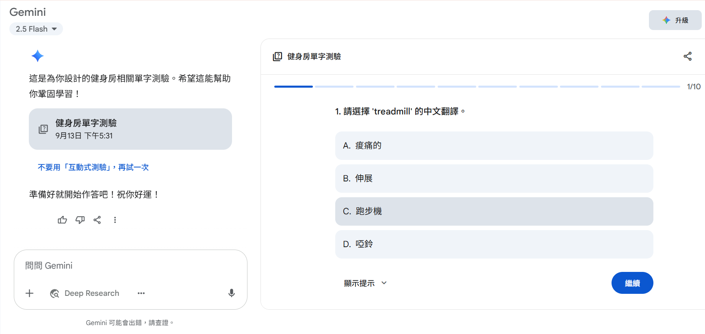
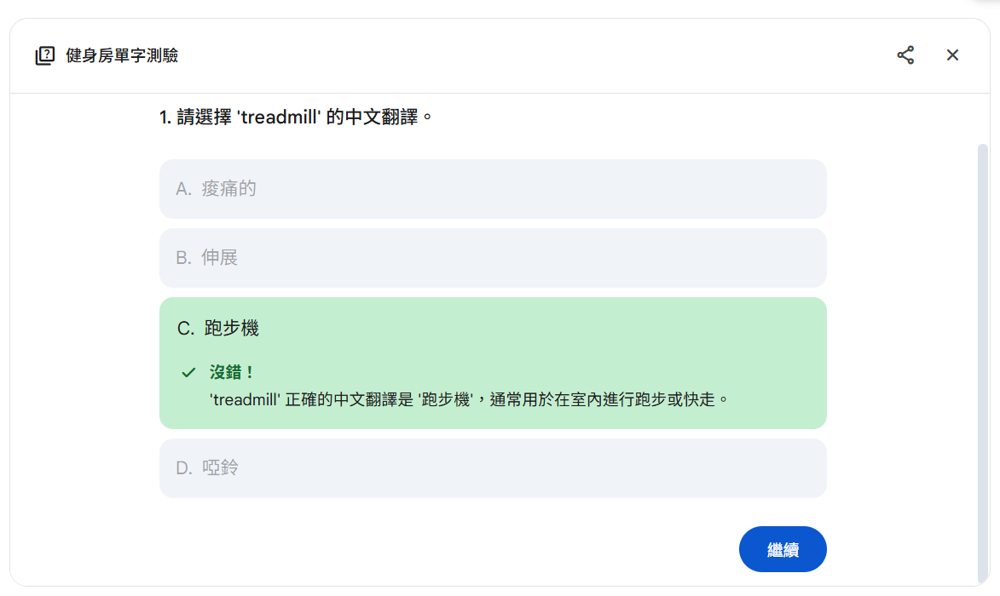
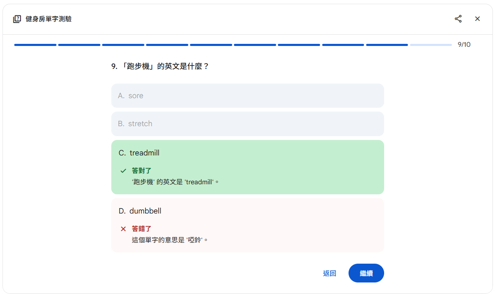
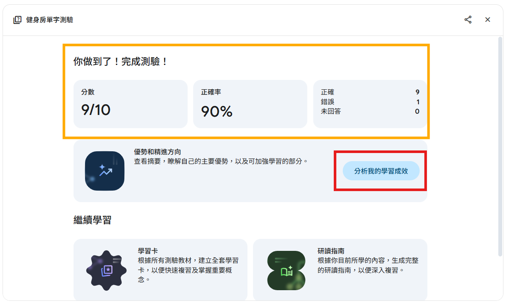
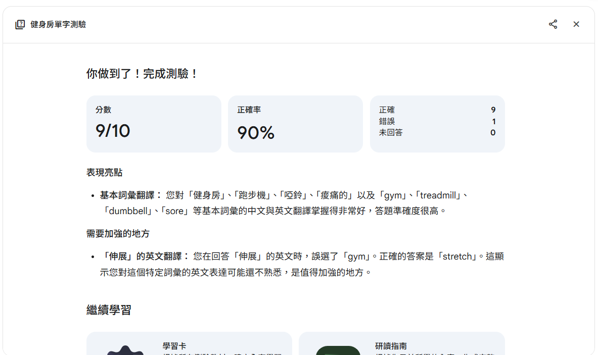

# Day 4｜主動回憶與記憶曲線，訓練大腦加深印象

在 Day 3 學習了情境學習與記憶錨點後，今天要介紹兩個能讓記憶更持久的科學方法：**主動回憶法**與**記憶曲線**。

當我們透過情境學習獲得了單字，並建立了記憶錨點後，下一步就是要確保這些知識能真正「留住」。單純重複閱讀或抄寫，往往只是「熟悉感」的錯覺，而主動回憶法能真正檢驗我們是否真的學會了。

---

**主動回憶法**，又稱主動提取法，是一種透過主動從記憶中提取資訊來增強記憶的學習技巧。相對於被動重複閱讀，學習者需要在沒有參考資料的情況下，嘗試回想所學內容。這個過程會強化記憶的神經連接，就像肌肉訓練一樣——每次主動「拉取」記憶，都在加強大腦的記憶肌肉。研究顯示，主動回憶比重複閱讀的學習效率高出 50% 以上。

**記憶曲線**由德國心理學家 Hermann Ebbinghaus 在 1885 年提出，描述人類學習後記憶的自然衰退規律。它揭示了一個關鍵事實：記憶在最初幾天衰退最快，之後逐漸趨緩。



*▲ Hermann Ebbinghaus記憶曲線圖*

**如圖所示**，紅色的曲線代表的就是記憶自然衰退的過程，它顯示了記憶量會隨著時間快速下降。而綠色的曲線則代表「間隔複習」的效果，它說明了每一次的複習都能將記憶曲線重置，並且隨著複習次數的增加，曲線會變得越來越平緩，代表記憶也變得越來越穩固。這張圖清晰地說明了，**當主動回憶遇上記憶曲線，就形成了科學化的學習系統**：在記憶即將衰退的關鍵時間點，透過主動回憶來重新強化記憶。

可是單純知道記憶曲線只能告訴我們「什麼時候複習」，但不知道「如何複習才有效」。而主動回憶法告訴我們「如何複習」，但沒有最佳時機。**當主動回憶遇上記憶曲線，就形成了科學化的學習系統**：在記憶即將衰退的關鍵時間點，透過主動回憶來重新強化記憶。

---

## 第一部分：主動回憶的實作方法

現在讓我們把理論轉化為實際的學習工具。我們將使用 Day 3 中學到的健身房相關單字，透過兩種主動回憶方式來練習。

### 方法一：配對遊戲（中英單字配對）

還記得 Day 3 我們學習的健身房單字嗎？現在用它們搭配 Gemini 學習功能來做配對練習。

#### 👉 實際可用的 Prompt 範本：

```
我正在學習以下健身房相關單字：  
gym(健身房)、treadmill(跑步機)、dumbbell(啞鈴)、stretch(伸展)、sore(痠痛的)  

請幫我設計一個學習卡測驗，包含：  
1. 10題配對選擇題（中英互譯）  
2. 每答完一題顯示正確答案  
3. 答錯時提供詳細解釋  
4. 最後統計答對率和學習建議  

並直接開始測驗，不須告訴我題目內容
```


*▲ 提供AI單字，製作單字卡測驗*



*▲ 單字卡測驗-答對畫面*



*▲ 單字卡測驗-答錯畫面*

> 答錯題目時，會自動顯示出正確答案，同時保留錯誤答案，可以明確知道錯誤
>


> 點選圖片紅框中的「分析我的學習成效」
>



*▲ 完成學習卡後會得到剛剛答題(10題)的狀況*

### 方法二：填空遊戲（情境文章填空）

第二種方法是把單字放回情境中，透過填空來檢驗理解程度。

#### 👉 實際可用的 Prompt 範本：

```
請用我學過的健身房單字（gym, treadmill, dumbbell, stretch, sore），  
創建一篇「第一次去健身房」的短文，並設計成填空練習：  

1. 短文長度約 100-150 字  
2. 將學過的單字設為空格  
3. 提供單字選項但順序打亂  
4. 完成後請檢查答案並給予回饋  
```

---

## 第二部分：記憶曲線的實際應用

當我們有了配對和填空的主動回憶工具後，下一步就是**依照記憶曲線排定複習**。

基於記憶曲線，建議的複習時間點為：

* **第1次複習**：學習後 1 天
* **第2次複習**：學習後 3 天
* **第3次複習**：學習後 1 週
* **第4次複習**：學習後 2 週
* **第5次複習**：學習後 1 個月

#### 👉 Prompt 範例：

```
我正在學習以下單字：gym, treadmill, dumbbell, stretch, sore  
請幫我依照記憶曲線規劃複習時間表，並在每次複習時提供 3 題配對或填空測驗。  
```

AI 的回應通常會給你一個「建議表格」，告訴你在哪些天該安排練習。不過要注意，AI 目前不能自動提醒你複習，真正自動化的安排仍需要用 **Anki** 這類間隔重複軟體來完成。

---

## 結語

主動回憶法結合記憶曲線的學習系統，能讓我們：

1. **科學化學習**：透過主動回憶真正檢驗學習成效，而非被動重讀的假象
2. **最佳時機復習**：在記憶即將衰退前進行強化，提高學習效率
3. **個人化調整**：根據表現調整複習頻率，避免過度或不足的練習
4. **長期記憶建立**：將短期記憶轉化為可長期保持的知識

當你掌握了情境學習、記憶錨點，再加上主動回憶與記憶曲線，你已經具備了完整的科學學習工具組。雖然 AI 無法自動提醒復習，但它能幫你建立完善的學習計劃。

> 接下來的文章中，我們將介紹如何將這些方法整合到 Anki 等間隔複習軟體中，實現真正自動化的科學學習系統，讓復習提醒和進度追蹤都能自動完成！
