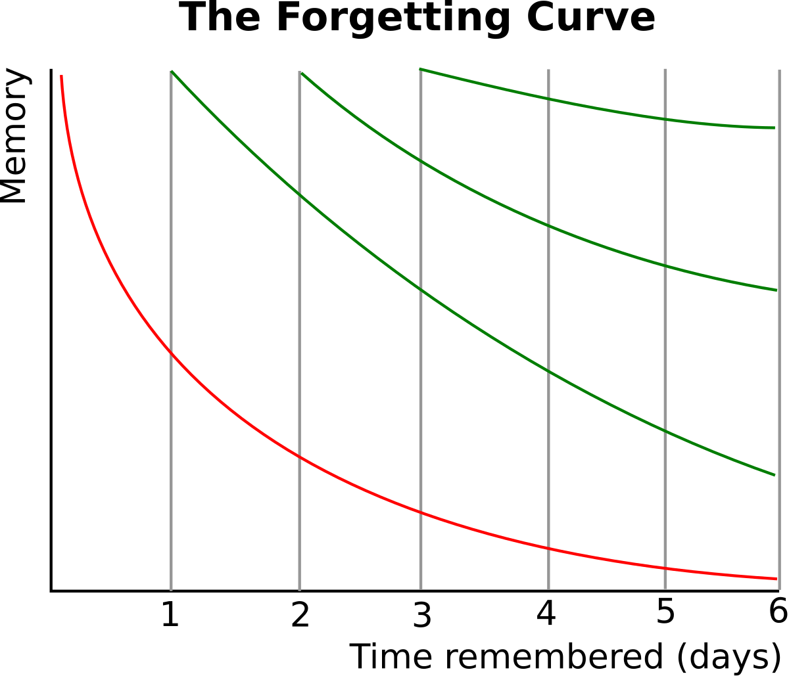

# Day 5｜用間隔複習，讓英文知識成為長期記憶

在 Day 4 學習了主動回憶法後，我們已經知道如何透過測驗來檢驗學習效果，確保真正掌握單字而不是只有「看起來熟悉」的假象。但光是知道「如何有效學習」還不夠，更關鍵的問題是：「什麼時候複習最有效？」

今天我們要深入探討**記憶曲線**的科學原理，並學習如何運用間隔複習讓你的英文知識從短期記憶轉化為長期記憶。

**記憶曲線**由德國心理學家 Hermann Ebbinghaus 在 1885 年提出，描述人類學習後記憶的自然衰退規律。它揭示了一個關鍵事實：記憶在最初幾天衰退最快，之後逐漸趨緩。

*▲ Hermann Ebbinghaus記憶曲線圖*

**如圖所示**，紅色的曲線代表的就是記憶自然衰退的過程，它顯示了記憶量會隨著時間快速下降。而綠色的曲線則代表「間隔複習」的效果，它說明了每一次的複習都能將記憶曲線重置，並且隨著複習次數的增加，曲線會變得越來越平緩，代表記憶也變得越來越穩固。

這張圖清晰地說明了，**當主動回憶遇上記憶曲線，就形成了科學化的學習系統**：在記憶即將衰退的關鍵時間點，透過主動回憶來重新強化記憶。

---

## 五個科學理論複習&統整

## 記憶曲線的實作方法(Anki)

