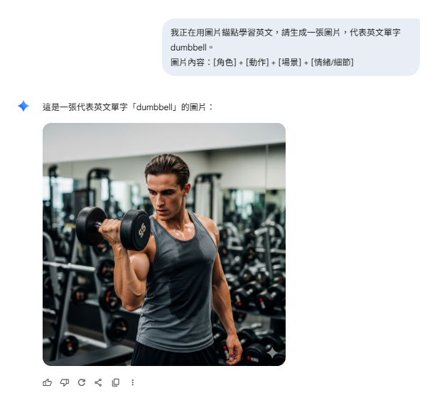
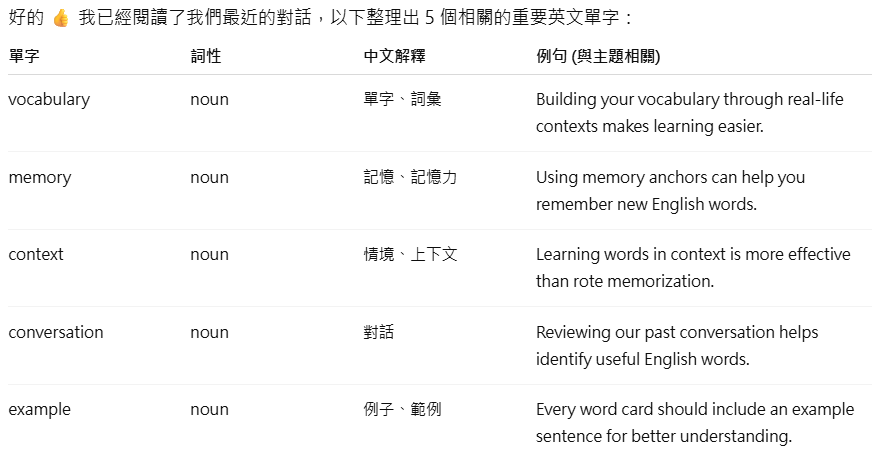
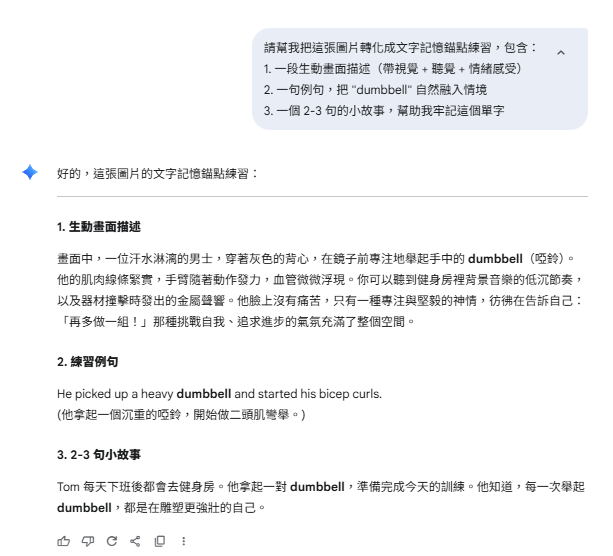

# 如何讓英文單字不再只是死記硬背？情境學習與記憶錨點的運用

大家好！今天我們來聊一個話題：要如何讓你在學習英文單字時，不只是死記硬背，而是能真正「活」起來，並且牢牢記住？

最近在研究如何更有效率地學英文時，發現了兩個超棒的方法：**情境學習**與**記憶錨點**。

**情境學習**強調的是，語言不是一個個孤立的單字，而是在真實或擬真場景中的應用。當你把單字放在一個具體的情境中理解，例如「第一次去健身房的經歷」，這些單字就有了生命力，你會自然地將它們與你的個人經驗和感受連結在一起，理解和應用也將更為靈活。

**記憶錨點**則來自於**心理學家 Allen Paivio 在 1971 年提出的雙重編碼理論（Dual-Coding Theory）**。這個理論認為，當我們學習一個單字時，如果能同時運用語言和圖像兩種系統來處理資訊，例如將單字與畫面、情緒、聲音等感官記憶綁定，記憶效果會比單純背誦文字強得多。

因此，我決定跟大家分享我這次的學習流程：先透過**情境學習**引出單字，再利用**記憶錨點**練習來強化記憶。

## 第一部分：情境學習

### 什麼是情境學習

情境學習強調語言的使用是在真實或擬真場景中，而不是單純記憶單字。這樣你在理解與應用上會更為自然與靈活。

### 怎麼從情境引出單字

**方法一（主題導向）** 先設定一個情境主題，讓 AI 幫你生成與該主題相關的單字與例句。

**方法二（對話回顧）** 如果你先前跟 AI(ChatGPT) 有對話，從對話中提取出與你自己經驗有關的單字。

#### 實際可用的 Prompt 範本：

> 👉 **方法一：主題導向 Prompt**
```
請幫我生成 5 個與「第一次去健身房的經歷」相關的英文單字卡。
欄位包含：單字, 詞性, 中文解釋, 例句(與主題相關)
```



*▲ 實際操作示範：將上述 Prompt 輸入 AI 工具後的對話過程*

> 👉 **方法二：對話回顧 Prompt**
```
請閱讀我和你之間的對話內容，找出相關的5個重要英文單字。
欄位包含：單字, 詞性, 中文解釋, 例句(與主題相關)
```



*▲ 實際操作示範：將上述 Prompt 輸入 AI 工具後的對話過程*

## 第二部分：記憶錨點練習

當我們透過「情境學習」已經得到一組單字後，下一步就是要讓它們真的「黏」在腦海裡。當一個單字同時以「圖像」和「語言」兩種形式儲存在大腦中時，記憶會更牢固，也更容易被喚起。

在 AI 的幫助下，我們可以很輕鬆地完成這個步驟。建議的流程是：

### 步驟一：圖片錨點（直觀記憶）

先讓 AI 生成與單字對應的圖片，這樣能建立第一層「直覺」的錨點。

> 👉 **Prompt 範例**（使用 dumbbell 來作範例）：

```
我正在用圖片錨點學習英文，請生成一張圖片，代表英文單字 "___"。
圖片內容：[角色] + [動作] + [場景] + [情緒/細節]
```
其中"___"輸入要生成圖片的單字。


*▲ 實際操作示範：將上述 Prompt 輸入 AI 工具後的對話過程*

這些圖片能夠直接把單字和一個具體的畫面綁在一起，避免「死背文字」的抽象感。

### 步驟二：文字錨點（深化語境）

接著，我們再利用圖片作為基礎，請 AI 幫我們生成更豐富的文字描述。這樣單字不僅有「圖像記憶」，還能帶入感官和故事。

👉 **Prompt 範例**：

繼續在練習圖片錨點的對話框中練習：
```
請幫我把這張圖片轉化成文字記憶錨點練習，包含：  
1. 一段生動畫面描述（帶視覺 + 聽覺 + 情緒感受）  
2. 一句例句，把 "___" 自然融入情境  
3. 一個 2-3 句的小故事，幫助我牢記這個單字
```
其中"___"輸入與圖片錨點產出圖片相同的的單字。



*▲ 實際操作示範：將上述 Prompt 輸入 AI 工具後的對話過程*

透過這樣的做法，圖片提供了「直覺的第一層錨點」，而文字則進一步帶入**場景、情緒、語境**，成為「第二層深度錨點」。

這樣一來，每個單字都會先透過圖片被「看見」，再透過故事被「感受」，最後在腦海中形成牢固的錨點。

## 結語

這樣的教學順序，有幾個好處：

1. 先透過**情境學習**，讓單字與生活經歷連結，理解更快、意義更強
2. 再透過**記憶錨點**，把這些單字鎖在你的感官與情緒裡，不只是「知道」這個字，而是「能感受」這個字

最終你會發現單字不再輕易忘記，也比較敢開口用、敢在真實對話中用。

> 在後續的文章中，我們會詳細介紹主動回憶，並將這些單字卡匯入 Anki，建立科學化的複習排程，讓學習效果更持久！
