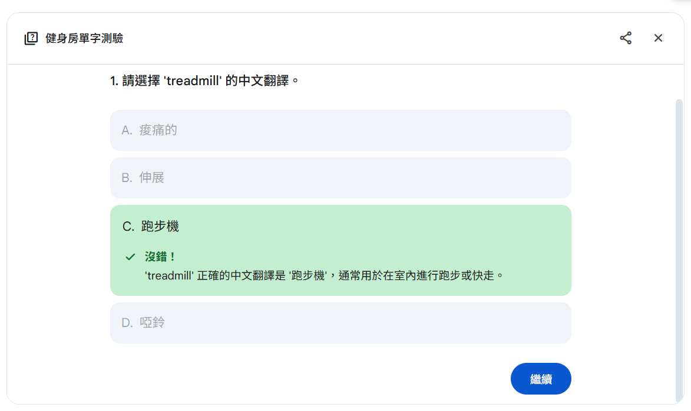
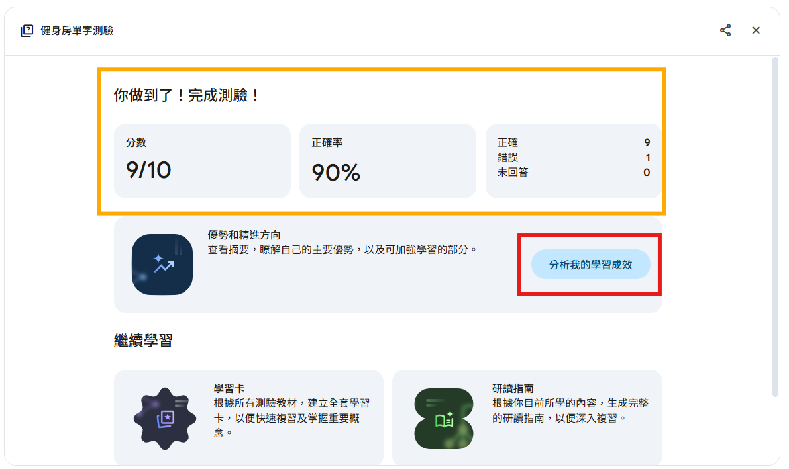
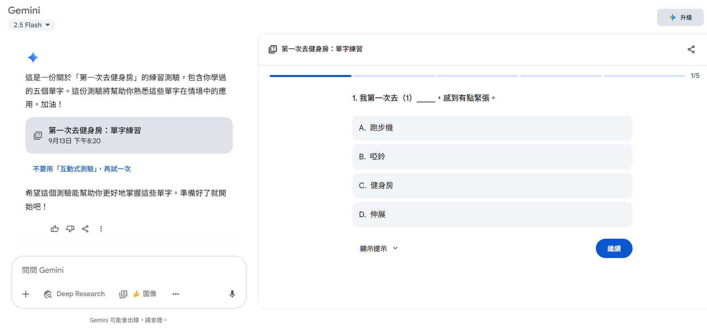

### D4. 主動回憶 (Active Recall)，記憶曲線，及如何使用AI實現
一些小想法：生成文章or句子挖空，使其回憶(要有prompt範例和截圖操作過程給讀者參考)

在Day 3學習到了記憶錨點，今天讓我們來了解甚麼是**主動回憶**

主動回憶法（Active Recall），又稱主動提取法或主動測試法，是一種透過主動從記憶中提取資訊來增強記憶和理解能力的學習技巧。 學習者在沒有參考資料的情況下，嘗試回想所學內容，這項努力能加強記憶的神經連接，相比被動學習，能夠更有效地加強記憶和學習效率


而主動回憶法中有一個重要的核心**記憶曲線**
**記憶曲線**- 由德國心理學家 Hermann Ebbinghaus 提出，描述人類在學習後記憶的自然衰退速度。

根據實驗，若不複習，學習後：
- 20分鐘後會忘掉約42%
- 1小時後忘掉56%
- 1天後忘掉74%
- 1週後忘掉77%
- 1個月後忘掉79%
這條曲線顯示：記憶在最初幾天衰退最快，之後逐漸趨緩。

## 第一部分:設計練習-配對遊戲(以英文-中文單字為例)
提供AI中英單字對照，並請AI生成遊戲
**方法一** 提供單字，請AI生成練習卡
```
1. 將以上的單字設計成中英配對遊戲
2. 隨機提供英文或中文
3. 你問我答
4. 我答輸入答案後，提供正確答案，接著才能進入下一題
```

*▲ 提供單字給AI，並產生互動式問答練習卡*


*▲ 答對畫面*


*▲ 答錯畫面，同時顯示正確及錯誤的内容*


*▲ 最終有簡單的分析*

> 生成更多問題，可以選擇針對“所有題目”或“錯誤部分”新增練習題目
 
*▲ 生成更多問題*
> 分析我的學習成效，“答對”的部分給予鼓勵 ； “答錯“的部分會提供建議
> 可以選擇再做一次綜合練習複習所有單字，也可以針對答錯的題目進行加強記憶
> 

*▲ 分析我的學習成效*


**方法二**請AI針對某種主題生成練習卡
```
1. 將以上的單字設計成中英配對遊戲
2. 隨機提供英文或中文
3. 你問我答
4. 我答輸入答案後，提供正確答案，接著才能進入下一題
```


